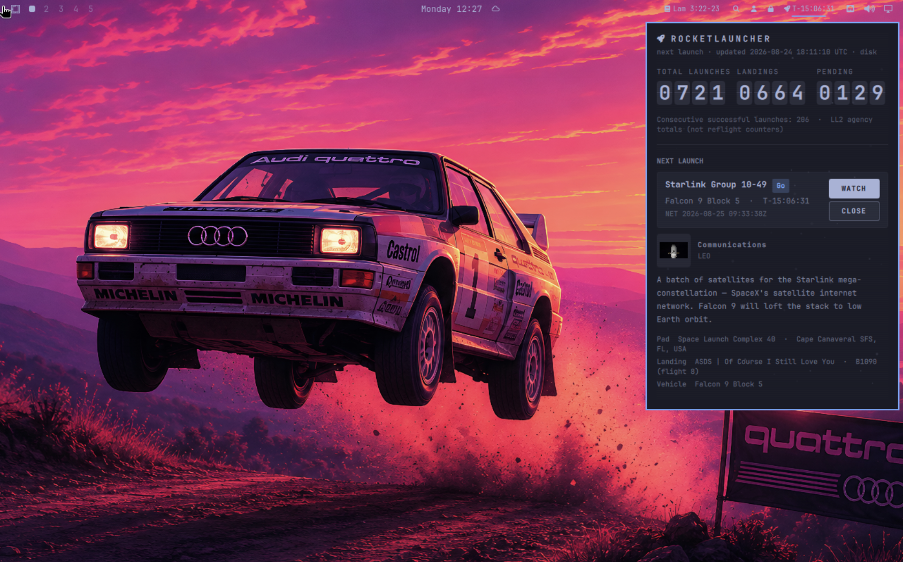

# Rocketlauncher



Rocket-pilot Falcon & Starship board for Omarchy — flip-digit stats, countdown,
ongoing missions, past missions, expandable mission detail, and in-panel Watch. Built as a
native Quattro `bar-widget` (not Electron). Named for Heinlein’s Rocketlauncher vibe
(rocket pilot) — unofficial; not SpaceX-branded.

**ID:** `kenhara.rocketlauncher`  
**Author:** Harris Kenny  
**License:** MIT  
**Version:** 1.5.14  

### 1.5.14
- Tintable FA rocket bar glyph (Nerd Font `\uf135`); accent-green chip when next launch `webcast_live`.
- New setting `barShowCountdown` (default on) — hide countdown from the bar chip; tooltip + panel still show it.
- Watching-only (`▶`) no longer forces green — only LL2 `webcast_live`.

### 1.5.13
- MissionCard: stack Watch / Detail vertically (compact rows grow for two buttons).
- Upcoming section EXPAND / COLLAPSE (default expanded); show Watch when webcast known.
- MissionDetail: broader hasDetail + thin-stub fallback; Upcoming loading / lastError near card.
- Detail fetch failure keeps expand open and seeds a list-mode stub.
- Shortcuts: W watch · D detail (footer).

### 1.5.12
- MissionDetail: coerce patch/type/orbit row `visible` to bool (fixes QML bool warn).

### 1.5.11
- Real DETAIL / CLOSE secondary buttons on Next, Upcoming, and Past cards (Watch stays primary filled).
- Past and Ongoing section headers use EXPAND / COLLAPSE secondary buttons (no fragile full-header tap).

### 1.5.10
- python3 -B + PYTHONDONTWRITEBYTECODE on stream-proxy Process (stops __pycache__ reload storms).

**Repo:** https://github.com/kenhara/omarchy-rocketlauncher

### 1.5.4
- Renamed plugin id `harris.rocketlauncher` → `kenhara.rocketlauncher` (install path `~/.config/omarchy/plugins/kenhara.rocketlauncher`). Display name unchanged.

### 1.5.3
- Discoverability: category **Widgets**; expanded `keywords` + `barWidget.aliases`; honest search note.

### 1.5.1
- Pre-ship checklist: LICENSE second Software unquoted; FileView cache without mkdir race; drop dead `dataChanged` + invented summon handlers; https-only openUrl with honest toasts; PlainText on remote mission fields; button hover; version/UA sync.

### 1.5.0
- Audit fixes: panel Flickable scroll, stickyWatch MediaPlayer hoist, resilient Watch after detail fetch, sample-cache / stream-proxy / README cleanup.
- Font fallbacks use concrete `"monospace"` when bar theme font is unavailable.

### 1.4.2
- Renamed to **Rocketlauncher** (`kenhara.rocketlauncher`); cache → `~/.cache/rocketlauncher`.
- Local folder + GitHub: `kenhara/omarchy-rocketlauncher`.

## Unofficial disclaimer


**Rocketlauncher is unofficial.** It is **not** affiliated with, endorsed by, or
sponsored by Space Exploration Technologies Corp. (“SpaceX”) or any related
entity. This plugin does **not** ship SpaceX logos, wordmarks, or brand assets.
Mission/vehicle names and trademarks mentioned in launch data belong to their
respective owners. Launch schedules and imagery metadata come from
[Launch Library 2](https://ll.thespacedevs.com/docs/) (The Space Devs); the
plugin links to LL2-hosted images and does not redistribute those binaries.

## Discoverability

Marketplace filing: **Widgets** · tags `bar, media, quickshell`.

Top-level `keywords` in `manifest.json` may help marketplace/search (SpaceX,
NASA, Falcon, Starship, LL2, webcast, etc.). `barWidget.aliases` are for
discovery docs and human search — the bar loader may not index them. Display
name stays **Rocketlauncher** (brand-free).

## Install

### From GitHub

```sh
omarchy plugin add https://github.com/kenhara/omarchy-rocketlauncher.git --enable
omarchy bar move kenhara.rocketlauncher --section right
```

### Local copy

The **git repo root is the plugin** (`manifest.json` at root). On an Omarchy
machine:

```sh
mkdir -p ~/.config/omarchy/plugins
cp -a . ~/.config/omarchy/plugins/kenhara.rocketlauncher

omarchy plugin validate ~/.config/omarchy/plugins/kenhara.rocketlauncher
omarchy-shell shell rescanPlugins
omarchy bar move kenhara.rocketlauncher --section right
```

Hot reload applies on save under `~/.config/omarchy/plugins/`.

### Optional dependencies (in-panel Watch)

Watch embeds when possible via **Qt Multimedia** + a small localhost helper:

| Dep | Why |
|-----|-----|
| `python3` | Runs `scripts/stream-proxy.py` |
| `yt-dlp` | Resolves YouTube / (sometimes) X / other webcast URLs to a playable stream |

```sh
# Arch / Omarchy examples
sudo pacman -S python yt-dlp
# or: pipx install yt-dlp
```

Without these, **WATCH** still works: the panel shows a thumbnail fallback and
**Open original** (or the store opens the URL externally). The plugin never
bundles binaries and never runs remote installers.

## Usage

- **Left-click** the bar rocket + countdown (`T-02:14:33` or `NET Aug 25`) to
  open/close the panel. Opening fetches **mission detail** for the next launch
  (cached by id after the first hit). **Middle-click** play/pauses Watch when
  active, otherwise refreshes data. **Right-click** starts Watch for the next
  launch.
- **Past Missions** — expand the section in the panel to load the last few
  SpaceX launches (`/launches/previous/`, lazy on first expand to save free-tier
  quota). Tap a card for the same on-demand mission detail as Next / Upcoming.
  Offline sample cache ships a few past rows from research fixtures.
- Crew avatars with a Wikipedia / LL2 astronaut URL are clickable (opens in the
  browser). Pointer cursor only appears on actionable controls.
- Tap the next-launch card to expand/collapse detail (description, pad,
  landing, patch, crew when present). Starlink-style flights omit the empty
  crew section.
- **WATCH** prefers an in-panel player (YouTube / HLS when `yt-dlp` can
  resolve). Official webcasts are often **X broadcasts** — those try
  `yt-dlp` first, then degrade to the webcast `feature_image` + **Open
  original**. We never claim X always embeds.
- Flip counters animate when totals change; the faint starfield pauses while
  the panel is closed **or** while Watch is active (perf).

### Controls

| Input | Action |
|-------|--------|
| Left-click bar | Toggle panel |
| Middle-click bar | If Watch is active: play/pause; else refresh launch data |
| Right-click bar | Open Watch for next launch (panel opens; falls back toward Open original when no webcast) |
| Escape | Close panel (see `stickyWatch` below) |
| Space | Play / pause Watch (or start Watch for next launch) |
| `M` | Mute / unmute |
| `O` | Open original webcast URL |
| `S` | Stop Watch (tears down player + proxy even when sticky) |
| WATCH button | Start in-panel Watch |
| PLAY / PAUSE / MUTE / OPEN ORIGINAL | Same as keys, on the Watch chrome |
| Tap next-launch card | Expand / collapse mission detail |
| Tap upcoming / past card | Expand / collapse mission detail for that id |
| Past Missions header | Expand section (lazy-loads previous launches once) |
| Crew avatar (when linked) | Open Wikipedia / LL2 astronaut page |

### stickyWatch (Meet-style PiP)

Schema default is **`false`** (pause-on-hide). When **`true`**, Watch aims to
**stay up while you work, like Meet PiP** — Esc / click-away hides the panel
but MediaPlayer + `stream-proxy.py` keep running from a **BarWidget-hoisted**
player (outlives the keyboard panel). Treat sticky playback as
**best-effort** until verified on a live Omarchy shell / UTM VM.

- **`stickyWatch: false` (default):** Esc / hide **pauses** Watch, clears the
  stream URL, and **stops** `stream-proxy.py`. Reopening does **not**
  auto-resume — press **WATCH** / **PLAY** (or Space) again.
- **`stickyWatch: true`:** Esc / hide **keeps** MediaPlayer + the localhost
  proxy running in the background. The bar can show a **▶** glyph while Watch
  is active. Press **S** or the Watch **×** control to fully stop. Optional
  `systemd-inhibit --what=idle` runs while sticky Watch is playing (no
  privilege; skipped quietly if `systemd-inhibit` is missing). There is no
  safe `hyprctl` idle-inhibit dispatcher, so we do not call one.

### IPC

```sh
omarchy-shell shell toggle kenhara.rocketlauncher
omarchy-shell shell hide kenhara.rocketlauncher
```

Rocketlauncher is **`bar-widget` only** — use left / middle / right clicks on the
bar (and the keys above) rather than inventing summon payloads. Middle-click
play/pauses Watch when active, otherwise refreshes launch data; right-click
starts Watch for the next launch.

### Optional Hyprland bind

Paste into your own Hypr config if you want a key — **Rocketlauncher does not
edit** `~/.config/hypr/` or `shell.json` for you:

```ini
# hyprland.conf / binds.conf (example only)
bind = SUPER, L, exec, omarchy-shell shell toggle kenhara.rocketlauncher
```

## Configure

Widget settings (`shell.json` / bar widget schema):

| Key | Type | Default | Description |
|-----|------|---------|-------------|
| `refreshIntervalSec` | integer | `1800` | Poll interval in seconds. **Minimum 600** so the free Launch Library 2 tier (15 req/hour) is never hammered. |
| `notifyMilestones` | bool | `false` | Opt-in `notify-send` once per launch id at **T−10** and **T−0** (debounced in `~/.cache/rocketlauncher/cache.json`). |
| `barShowMissionName` | bool | `false` | Prefix the bar countdown with a short mission name. |
| `barShowCountdown` | bool | `true` | Show NET countdown on the bar chip. When off, chip is just the rocket (mission name still respects `barShowMissionName`); countdown stays in panel + tooltip. |
| `stickyWatch` | bool | `false` | Keep Watch playing when the panel hides — Meet-style PiP (see above). |
| `watchQuality` | enum | `best` | `best`, `720`, or `480` — passed to `scripts/stream-proxy.py` as yt-dlp height preference. |
| `starfieldEnabled` | bool | `true` | Faint panel starfield ambience (pauses while Watch is active). |
| `flipAnimate` | bool | `true` | Animate flip-digit counters when totals change. |

## Remove

```sh
omarchy plugin remove kenhara.rocketlauncher
```

Optional cache cleanup:

```sh
rm -rf ~/.cache/rocketlauncher
```

## Data & network

**Primary API:** [Launch Library 2](https://ll.thespacedevs.com/docs/) (The Space Devs)  
Base: `https://ll.thespacedevs.com/2.3.0/` · Falcon / Starship launches via LSP agency id **121**

### Refresh cycle (default every 30 minutes, never faster than every 10)

Up to **three** list GETs on the regular refresh cycle:

1. `GET /agencies/121/` — totals (launches, landings, pending, consecutive successes)
2. `GET /launches/upcoming/?lsp__id=121&limit=5&mode=list` — upcoming list (compact)
3. `GET /spacecraft/?search=Crew%20Dragon&in_space=true` — ongoing Crew Dragon

### Past missions (lazy)

On **first expand** of the Past Missions section (not on every refresh):

4. `GET /launches/previous/?lsp__id=121&limit=5&mode=list` — recent past launches

Bundled `data/sample-cache.json` includes offline past rows from
`docs/research/samples/ll2-spacex-previous-*.json`.

### Mission detail (on demand)

When you open the panel or expand the next / upcoming / past card:

5. `GET /launches/{id}/` — **one detailed fetch per id**, then cached in
   `~/.cache/rocketlauncher/cache.json` and in-memory `launchDetails`.

Do **not** detailed-fetch every upcoming/past row. Stay under the free tier
(**15 req/hour**).

**Cache path:** `~/.cache/rocketlauncher/cache.json`  
Offline fixtures: `data/sample-cache.json`, plus
`data/sample-detail-crew.json` / `data/sample-detail-starlink.json` for UI demos.

Labels are honest LL2 agency fields:

- **Total launches** → `total_launch_count`
- **Landings** → `successful_landings`
- **Pending** → `pending_launches`
- Meta line: **Consecutive successful launches** (site “reflight” counters are
  not a single LL2 agency field, so they are not shown as a fake total)

No API key is used (free tier). No scrapers, no sudo, no second Quickshell
process. Pure QML + Qt network (+ optional local `yt-dlp` helper for Watch).

## Privacy and safety

- Network: `ll.thespacedevs.com` for launch data; when Watch is used,
  `yt-dlp` contacts the webcast host (YouTube / X / etc.) and the helper
  binds **127.0.0.1 only**.
- Disk: read/write `~/.cache/rocketlauncher/cache.json`; read bundled samples.
- Opens user-selected webcast URLs in the default browser as a fallback.
- Optional `notify-send` toasts when `notifyMilestones` is enabled (FreeDesktop Notifications).
- Optional `systemd-inhibit --what=idle` while `stickyWatch` Watch is playing (user-session inhibit only; not used when sticky is off).
- Zero privilege beyond normal desktop user permissions inside `omarchy-shell`.

## License

MIT — see `LICENSE`. Copyright (c) 2026 Harris Kenny.

Launch data © The Space Devs / Launch Library 2 contributors. Imagery URLs in
samples may carry CC BY-NC or NASA terms — this plugin does not redistribute
those binaries; it only links or references metadata. No SpaceX logos or
wordmarks are shipped.
